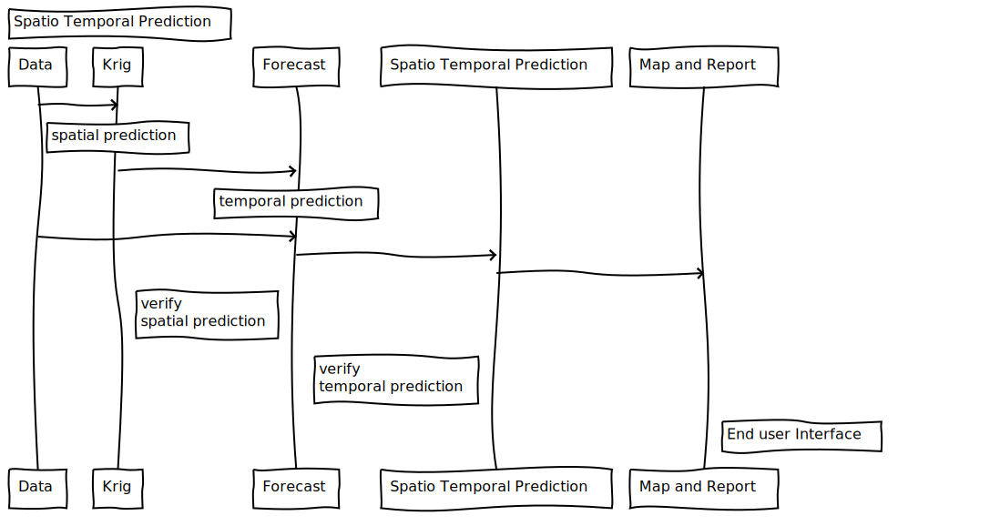

# Spatial_PaF  
Spatial prediction and forecasting  

This project is about predicting climate data at unkown locations which requires a two step approach:  
1. Predict spatial distribution  
2. Then using data from 1 to predict/forcast climate data for the next 365 days  

